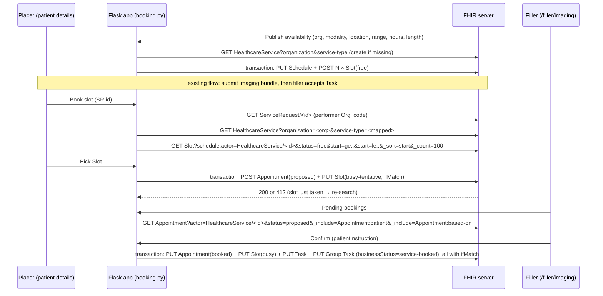

# Design: Imaging Appointment Booking

## Decisions (from the design grill, 2026-10-01)

| # | Decision | Choice |
|---|---|---|
| 1 | Request flow to book against | Diagnostic imaging bundle (`bundler.py`) |
| 2 | Who books | Referrer after triage (main flow) **and** filler direct-books (variant) |
| 3 | Source of Slots | Filler "publish availability" UI, plus a thin seed CLI over the same generator |
| 4 | SR → Slot resolution | `SR.performer` Org → `HealthcareService?organization&service-type` → `Slot?schedule.actor` (two calls, no chaining) |
| 5 | Write semantics | Transactions with `request.ifMatch` optimistic locking; Slot `busy-tentative` at propose |
| 6 | Placer UI | "Requests & Appointments" panel on the patient details page |
| 7 | Filler UI | New `/filler/imaging` page (not the airport board, not `/filler`) |
| 8 | Appointment content | Participants as tabled below; Patient `accepted` at propose |
| 9 | Task status on booking | Stays `accepted`; businessStatus `service-booked`; airport `booked` → `service-booked` |
| 10 | v1 lifecycle | Publish, propose, confirm, decline, direct-book, cancel, atomic reschedule |
| 11 | Profiles | Claimed behind `CLAIM_BOOKING_PROFILES` (default on); offline validation against the rebuilt IG package |
| 12 | Tests | pytest unit + route tests (committed); opt-in live e2e (`FHIR_E2E_URL`) |

## Profiles

Canonical base: `http://aehrc.csiro.au/fhir/radiology-referral/StructureDefinition/`

| Resource | Profile | Notes |
|---|---|---|
| Schedule | `booking-schedule` | `actor` = HealthcareService + Location (Organization is not allowed) |
| Slot | `booking-slot` | `schedule` → BookingSchedule |
| Appointment | `referral-appointment` | `basedOn 1..*` → AU eRequesting Imaging ServiceRequest |
| HealthcareService, Location | AU Base (unprofiled in the IG) | `HealthcareService.providedBy` = filler Organization |

The IG's `output/` is stale: it was built from an old path with the old canonical
`.../fhir/referral`. Rebuild the package (`sushi` + IG Publisher) before running validation.

## Data flow

## Transactions

All transactions use `request.ifMatch: W/"<versionId>"` on every PUT of an existing resource.

| Action | Entries |
|---|---|
| Publish | PUT Schedule (conditional on identifier) + POST Slot × N (`free`) |
| Propose (placer) | POST Appointment `proposed` + PUT Slot `busy-tentative` |
| Confirm (filler) | PUT Appointment `booked` (HealthcareService/Location participants `accepted`, `patientInstruction`) + PUT Slot `busy` + PUT Task + PUT Group Task (`businessStatus=service-booked`) |
| Decline (filler) | PUT Appointment `cancelled` (+ `cancelationReason`, HealthcareService participant `declined`) + PUT Slot `free` |
| Direct-book (filler) | POST Appointment `booked` + PUT Slot `busy` + PUT Task + PUT Group Task |
| Cancel (placer) | PUT Appointment `cancelled` (+ `cancelationReason`) + PUT Slot `free` + PUT Task + PUT Group Task (businessStatus removed) |
| Reschedule (placer) | Cancel entries for the old Appointment/Slot + Propose entries for the new Slot |

Task status is **never changed** by booking; only `businessStatus` changes
(`http://terminology.hl7.org.au/CodeSystem/task-business-status#service-booked`).

## Appointment content

| Element | Value |
|---|---|
| `meta.profile` | `referral-appointment` (if `CLAIM_BOOKING_PROFILES`) |
| `identifier` | Local placer booking id (`urn:uuid` value) |
| `status` | `proposed` → `booked` / `cancelled` |
| `basedOn` | `ServiceRequest/<id>` |
| `slot` | `Slot/<id>` |
| `start`, `end`, `serviceType` | Copied from the Slot |
| `reasonCode` / `reasonReference` | Copied from the ServiceRequest |
| `created` | Now |
| `patientInstruction` | Set by the filler on confirm or direct-book |

| Participant | `required` | At propose | At confirm |
|---|---|---|---|
| Patient | `required` | `accepted` | `accepted` |
| HealthcareService (from Schedule) | `required` | `needs-action` | `accepted` (`declined` on decline) |
| Location (from Schedule) | `required` | `needs-action` | `accepted` |
| Requesting PractitionerRole | `information-only` | `accepted` | `accepted` |

## Gating ("is bookable")

An imaging SR is bookable when its fulfilment Task is `accepted` **and** no Appointment with
`basedOn` = SR has a status in `{proposed, pending, booked}`.

## Service-type mapping

`ServiceRequest.code` is an imaging *procedure*, but `HealthcareService.type` and
`Slot.serviceType` are a *service* (e.g. SCT 310128004 "Computed tomography service").
`service_type_for()` matches modality keywords in `code.coding.display` and `code.text`:

| Keywords | Service type |
|---|---|
| CT, computed tomography | 310128004 |
| MRI, magnetic resonance | 310127009 |
| US, ultrasound | 310169008 |
| X-ray, radiograph | 933537131000036109 |
| nuclear, scintigraphy, PET | 788009005 |

If nothing matches, the `service-type` filter is omitted. SNOMED subsumption via Ontoserver
would be more rigorous, but it adds a runtime terminology dependency.

The Slot picker has **no Location filter in v1**. Slots are grouped by day, and each one shows
its Schedule's actors as a tooltip.

## Slot generation

Pure function: `(start_date, end_date, weekdays, day_start, day_end, slot_minutes, tz)` →
list of `(start, end)`. Default timezone is `Australia/Brisbane` (+10:00, no DST). Weekends are
skipped by default. Publishing is idempotent per Schedule: if a Slot already exists with the
same start, it is skipped.

## Error handling

- New partial `partials/operation_outcome.html` renders `issue[].severity / code / diagnostics`
  inline.
- A 412 (or 409) on propose or reschedule shows "This slot was just taken — please choose
  another" and re-runs the Slot search.
- Transaction-response entries are checked per entry. Any non-2xx is shown with the
  OperationOutcome.

## Code layout

| File | Role |
|---|---|
| `booking.py` | Pure builders (Slot generator, resources, transaction bundles, service-type map, gating) plus a thin `requests` client that reuses the auth/URL helpers |
| `booking_routes.py` | Flask blueprint: placer panel, slot search, propose/cancel/reschedule, `/filler/imaging` and its actions |
| `scripts/seed_slots.py` | CLI over the Slot generator and publish |
| `templates/filler_imaging.html` | Filler page |
| `templates/partials/booking_*.html` | Panel, slot picker, pending list, OperationOutcome |
| `app.py` | Register blueprint; `booked` → `service-booked` |

The auth/URL helpers (`get_fhir_server_url`, `get_fhir_auth_credentials`,
`get_fhir_bearer_token`) live in `app.py` today. Move them to `fhirutils.py` so the blueprint can
import them without a circular import.

## Before / After

**Before:** submit imaging bundle → filler accepts Task → (airport) businessStatus `booked`
(invalid code), with no Appointment resource.

**After:** submit imaging bundle → filler accepts Task → placer or filler books against a
published Slot → an Appointment and Slot exist on the server, and both Tasks carry businessStatus
`service-booked` while Task status remains `accepted`.

## Environment variables

| Key | Default | Purpose |
|---|---|---|
| `CLAIM_BOOKING_PROFILES` | `true` | Add IG `meta.profile` to Schedule, Slot and Appointment |
| `BOOKING_TIMEZONE` | `Australia/Brisbane` | Slot generation and display |
| `FHIR_E2E_URL` | unset | Enables `tests/e2e_booking.py` against a live server |

## Server assumptions to verify

- The target server (default Aidbox) honours `request.ifMatch` in transaction entries and
  returns 412 on version mismatch.
- `Slot?schedule.actor=`, `Appointment?actor=` and `_revinclude=Appointment:based-on` are
  supported.
- Unknown `meta.profile` canonicals are accepted (otherwise set `CLAIM_BOOKING_PROFILES=false`).
