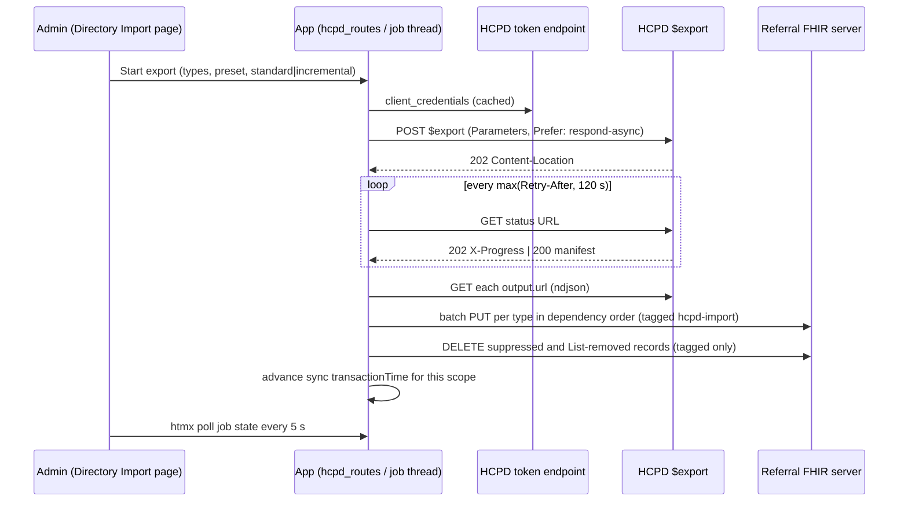

# Design: HCPD Bulk Import

## Decisions (2026-10-02)

| # | Decision | Choice |
|---|---|---|
| 1 | Destination | The referral FHIR server (PUT with HCPD ids) |
| 2 | HCPD auth | OAuth client credentials (production), cached until shortly before expiry; **static bearer JWT** (`HCPD_BEARER_TOKEN` / `_FILE`) for SIT |
| 3 | Job runner | Background thread; job state persisted as JSON under `instance/hcpd/` |
| 4 | Modes | Standard and incremental (`_since`, suppression, removal List) |

## HCPD contract (from IG 26.0.0, export-api.md and BatchRequest*.md)

- **Kickoff:** `POST [base]/$export`.
  - Body: a Parameters resource conforming to `hcpd-export-request-parameters`.
  - Headers: `Authorization: Bearer`, `Content-Type` and `Accept: application/fhir+json`,
    `Prefer: respond-async`, optional `X-Request-ID`.
  - Kickoff by `GET`, or with query parameters, is not supported.
- **Parameters:**
  - `_outputFormat` = `application/fhir+ndjson` (1..1)
  - `_type` (1..*, comma-separated)
  - `_typeFilter`: one or more per type in `_type`, each a separate entry targeting exactly one
    type, with no `_include` / `_revinclude`
  - `_since`: a valueInstant with time and timezone (0..1)
  - Allowed types: HealthcareService, Organization, Location, PractitionerRole, Practitioner,
    Provenance, Endpoint
- **Kickoff response:** `202` with `Content-Location` holding the absolute status URL.
- **Status polling:** `GET` the status URL.
  - `202`: still running. Carries `Retry-After` and `X-Progress`; polling is limited to one
    request per 120 s.
  - `200`: complete. The body is the manifest (`transactionTime`, `requiresAccessToken`,
    `output[{type, url}]`, `error[]`, optional `message`).
  - `400`: an OperationOutcome.
  - `404`: unknown or cancelled job.
- **Cancel:** `DELETE` the status URL → `202`.
- **Files:** `GET` each `output.url` with `Accept: application/fhir+ndjson`, and the token if
  `requiresAccessToken`. One resource per line.
- **Suppression:**
  - Suppressed records carry the extension
    `http://digitalhealth.gov.au/fhir/cc/StructureDefinition/suppressed`.
  - For an Organization, the record itself counts as suppressed only when the `includeSelf`
    sub-extension is true.
  - Inactive state is shown by `active` (Practitioner, PractitionerRole, Organization,
    HealthcareService) or `status` (Location `inactive`, Endpoint `off`).
- **Removal List:** an HCPD Export Response List whose `entry.item.identifier` uses one of:
  - HPI-O `http://ns.electronichealth.net.au/id/hi/hpio/1.0`
  - HSP-O `http://ns.electronichealth.net.au/id/hi/hspo/1.0`
  - HPI-I `http://ns.electronichealth.net.au/id/hi/hpii/1.0`
  - HCPD local `http://digitalhealth.gov.au/fhir/hcpd/id/hcpd-local-identifier` (Location,
    HealthcareService, PractitionerRole, Endpoint)

  The IG does not say how the List is delivered. We treat any `List` resource found in any
  output file as a removal List.

## Scope presets → linked `_typeFilter`s

Each preset gives a *base* criterion. Each selected type gets a filter that ties it to that same
base through chains, following the IG examples.

| Type | Geographic (`address-state=QLD`, city, postcode) | Service type (`service-type=sct\|X` + optional state) | Organisation (`identifier=hpio\|N` or `name=`) |
|---|---|---|---|
| Location | `Location?address-state=QLD` | `Location?_has:HealthcareService:location:service-type=…` | `Location?organization.identifier=…` |
| HealthcareService | `HealthcareService?location.address-state=QLD` | `HealthcareService?service-type=…[&location.address-state=QLD]` | `HealthcareService?organization.identifier=…` |
| Organization | `Organization?_has:Location:organization:address-state=QLD` | `Organization?_has:HealthcareService:organization:service-type=…` | `Organization?identifier=…` |
| PractitionerRole | `PractitionerRole?location.address-state=QLD` | `PractitionerRole?service.service-type=…` | `PractitionerRole?organization.identifier=…` |
| Practitioner | `Practitioner?_has:PractitionerRole:practitioner:location.address-state=QLD` | `Practitioner?_has:PractitionerRole:practitioner:service.service-type=…` | `Practitioner?_has:PractitionerRole:practitioner:organization.identifier=…` |
| Endpoint | `Endpoint?_has:PractitionerRole:endpoint:location.address-state=QLD` | `Endpoint?_has:HealthcareService:endpoint:service-type=…` | `Endpoint?organization.identifier=…` |

In advanced mode the `_typeFilter` lines are entered verbatim. The builder checks that every
`_type` has a filter and every filter targets a listed type, so the HCPD rule is enforced before
kickoff. Which chained parameters the server actually accepts is verified in the first live run
(task 7.2).

## Data flow



## Import to the referral server

- **Write order:** by type, in the dependency order Organization → Location → HealthcareService
  → Practitioner → PractitionerRole → Endpoint. This avoids referential-integrity rejections on
  servers that enforce them.
- **Batching:** `batch` Bundles of up to `HCPD_IMPORT_BATCH_SIZE` (default 100) `PUT
  <Type>/<id>` entries. Each entry's response status is counted, so one bad record doesn't fail
  the whole run.
- **Resource preparation:** server-managed `meta` (`versionId`, `lastUpdated`) is dropped, while
  `meta.profile` is kept. We add `meta.tag` `http://aehrc.csiro.au/fhir/patient-referral/tag|hcpd-import`
  and set `meta.source` to the HCPD base URL.
- **Deletes:** only resources carrying the import tag are deleted. A suppressed record is deleted
  by `<Type>/<id>`. A removal-List identifier is resolved with
  `GET <Type>?identifier=<system>|<value>&_tag=<import tag>` for the types that identifier
  system implies, and each match is deleted. A delete the server refuses (for example, the
  resource is still referenced by a Task) is counted as failed, not forced.
- **Incremental sync state:** stored in `instance/hcpd/sync.json`, keyed by a hash of the
  normalised request scope (types plus filters). The stored `transactionTime` advances **only**
  after every file has been downloaded and applied, as the IG requires. Incremental mode is only
  offered for a scope that has a stored time.

## Job model

```
submitted → polling → downloading → importing → complete
                 ↘ failed | cancelled            ↘ complete-with-errors
```

- One job file per job, `instance/hcpd/jobs/<job-id>.json`. It holds the request Parameters, the
  status URL, timestamps, the last `X-Progress`, the manifest, per-type counts and any errors.
  Writes are atomic (temp file then rename).
- Only one job may be active at a time (a process lock plus an on-disk check).
- On startup, a job left in `polling`, `downloading` or `importing` is shown as interrupted, with
  a **Resume** action. Resume re-polls the status URL; downloading and importing restart from the
  manifest.
- Time and HTTP are injected (`clock`, `sleep`, `session`) so the runner is fully testable
  without threads or waiting.

## SIT environment (connectathon notes, 2026-08-25)

- **Base:** `https://sit.healthconnect.digitalhealth.gov.au/adha/hcd-api-router/api/v1/fhir`
  (FHIR R4, read-only).
- **Tokens:** SIT uses pre-generated long-lived JWTs, not the Health Connect Authorisation
  Service. Scope is enforced per operation, so imports need `SIT-export.txt` or `SIT-all.txt`.
  The published tokens were valid **until 18 September 2026**, and the page warns when the
  configured JWT's `exp` has passed.
- **Headers:** `Authorization` and `Accept: application/fhir+json` on every request. Polling uses
  `Accept: application/json`, and downloads use `application/fhir+ndjson`. If `X-Request-ID` is
  sent, it must be a unique UUID per request (it is).
- **Validated against `/metadata`:** `_include` / `_revinclude` and chains. A search needs a
  substantive parameter (`active`, `status`, `suppressed` and system parameters don't count).
- **Blocked on Practitioner, including via chains:** `address*`, `gender` (use `rsg`) and the PBS
  prescriber number. The presets only reach address through `PractitionerRole.location`, which
  matches the IG's own export example.
- **Endpoint:** uses `status=off`, not `inactive`.

## Implementation notes

- **Credentials:** the referral server URL and credentials come from the request that starts (or
  resumes) a job. They live in memory only and are never written to job files. After a restart,
  **Resume** picks up the current user's Settings.
- **Cancel:** only honoured while a job is *submitted* or *polling* (`DELETE` on the status URL).
  Once download or import has started, the job runs to completion; the UI only offers Cancel
  before that point.
- **Sync point:** advanced only when every file was applied with **zero** failed records and
  the manifest has no `error` entries. Otherwise the job ends `complete-with-errors` and the
  next incremental export repeats the window. Re-applying a window is safe because records are
  keyed by id.
- **Inactive records** from an incremental export are upserted as they are (with `active=false`
  or `status=inactive|off`). The app's provider pickers are expected to filter on active status.

## Environment variables

| Key | Default | Purpose |
|---|---|---|
| `HCPD_EXPORT_SERVER` | `PD_SERVER` or the SIT router | HCPD FHIR base for `$export` |
| `HCPD_TOKEN_ENDPOINT` | — | OAuth token URL (client credentials) |
| `HCPD_CLIENT_ID`, `HCPD_CLIENT_SECRET` | — | OAuth client |
| `HCPD_SCOPE` | unset | Optional scope parameter |
| `HCPD_IMPORT_BATCH_SIZE` | `100` | PUT entries per batch Bundle |

If `HCPD_TOKEN_ENDPOINT` is unset, requests are sent without a token, and the page warns that
HCPD requires OAuth.

## Risks / to verify live

- Which chained and `_has:` parameters HCPD accepts inside `_typeFilter`. The presets may need
  adjusting.
- Whether the referral server accepts HCPD `meta.profile` canonicals and extensions it doesn't
  know.
- How the removal List actually arrives (assumed: inside the output files).
- Large exports: batching keeps memory bounded per file, but each NDJSON file is held in memory
  while it is applied.
